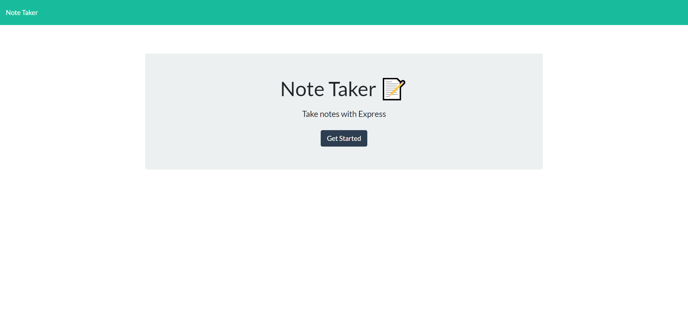

# Quick Note Taker

## Description
The goal of this app was to utilize Express and Heroku to deploy a live app that any user can access to create, edit, and delete notes that are stored on the server.

## Usage

The user can navigate to the following address to immediately begin using the application:
https://murmuring-escarpment-62590.herokuapp.com/

## Credits

 Thanks to the Georgia Tech Boot Camp for the support.

 ## License
 
 Licensed under the [MIT](https://github.com/Pkeld148/quick-note-taker/blob/main/LICENSE) 